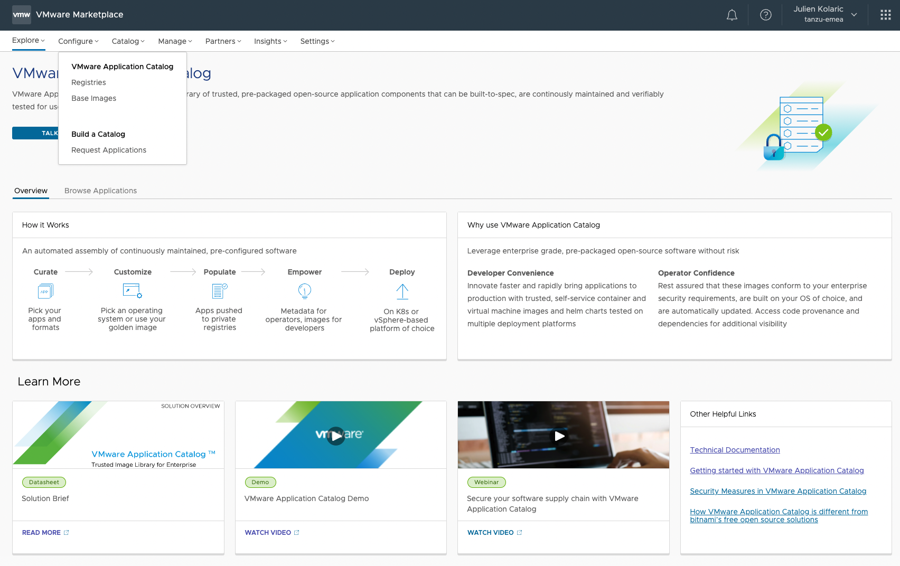

##### VMware Application Catalog - VAC
**Important**: 
- For the next sections, it is vital that you  make sure to sign-in to cloud.vmware.com with your **@vmware.com** email address and select the **"Tanzu End to End"** organization. Please be careful not to alter the services or configurations of the clusters in these environments as they are shared for the entire End to End Demo Environment.
- The VMware Application Catalog subscription applied in the **"Tanzu End to End"** organization does not allow to generate OCI artefacts. This is a demo environment

**VMware Application Catalog**, or **VAC** is formerly known as **Tanzu Application Catalog - TAC **. **VMware Application Catalog** is a **customizable** library of **trusted**, pre-packaged open-source application components that can be **built-to-spec**, are **continously maintained** and **verifiably tested for use in production** environments.

Enterprises can consume and deploy trusted and updated applications from a catalog tailored to their needs. This catalog is distributed through a private repository to internal customers.


**Important**: For the next sections, we will assume the customer has a valid subscription and is able to add its own registry into VMware Application Catalog.

To be able to use VMware Application Platform properly, few steps have to be done :
1. Login to VMware Marketplace with a valid VMware Application Catalog Subscription.
2. Add an Open Container Initiative (OCI) compliant registry.
3. Create application.
4. Use your application.

###### Login to VMware Marketplace
VMware Application Catalog is part of the VMware Marketplace website, when you are logged into the marketplace inside your organization, you will see this menu :

Open a tab to VMware Application Catalog in the **"Tanzu End to End"** organization.
```dashboard:open-url
url: https://marketplace.cloud.vmware.com/applicationcatalog/view?org_link=/csp/gateway/am/api/orgs/2f31c29c-e042-4ee4-8dbb-3e38b1f1eae5&orgLink=/csp/gateway/am/api/orgs/2f31c29c-e042-4ee4-8dbb-3e38b1f1eae5
```


###### add an OCI compliant registry 
**Important**: In the **"Tanzu End to End"** organization, the subscription does not allow to add the OCI compliant registry. The following section will show you how to add one to store your applications generated in the next section.

Click on **Configure** and, in the VMware Application Catalog section, click on **Registries** :


You will have the following page available to see your registries or create a new registry :


To add a new registry, click on **"+"** or **"ADD"** and fill the values accordingly.
**Note**: VMware Application Catalog provides support for several registry providers:
1. Harbor
2. Google Container Registry - GCR
3. Azure Container Registry - ACR 
4. Amazon Elastic Container Registry - ECR
5. Jfrog Artifactory Container Registry


In the example, we want to push OCI artefacts generated by VAC in the following registry :
- **Provider** : Harbor
- **Name** : jko-registry
- **Registry URL** : registry.cloud-garage.net/vac-library


###### Generate your application - Example of postgresql


###### Deploy the application - Example of postgresql
